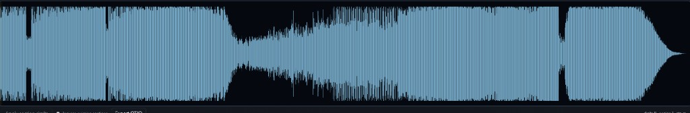
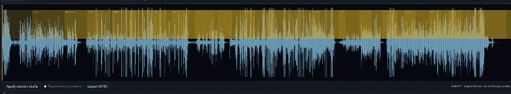
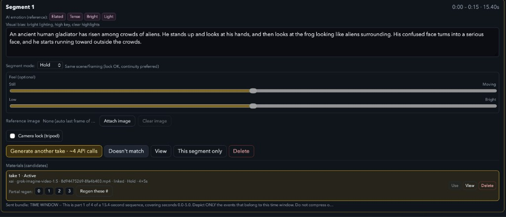

# Xochipilli（索奇皮利）

[English](README.md) | [日本語](README.ja.md) | **中文**

以手工为前提、运行在本地电脑上的 音乐→影像工作台。曲子就是时间线：由人打点切出要用的
区间，逐段写下调度，成片留在自己的磁盘上。

没有「丢进一首歌就吐出 MV」的按钮；加上它就是另一个产品了。
名称来自阿兹特克神话中的 **Xochipilli（花之王子）** — 歌、舞与艺术之神。

设计：**龙一 · Ryuichi Hamakawa**

## 导入曲目

刚导入的曲子除了波形之外什么都没有。



消化（digest）会读这首曲子，并提出区间候选。下图金色的色块就是，这里是 21 条，来自
librosa 的 novelty 检测。它的控件是一个叫 **Apply section drafts** 的按钮，所以可以采用、
替换，也可以放着不管、自己打点。为什么只到「提出」这一步，见
[DECISIONS.md](docs/DECISIONS.md)。



## 调度一个区间



那个大输入框是自己的，画面只由它来描述。上面机器的贡献被明确标为
**AI emotion (reference)**：四个词，可以不用。**Segment mode** 这里是 `Hold`，意思是同一
场景与构图，所以锁定镜头才是安全的。`Shift` 与 `Motion` 说的是相反的事。**Feel** 两条不动
就一直空着。

生成按钮写着 **`Generate another take · ~4 API calls`**。这个区间是 15.4 秒而单位是 5 秒，
所以一条成片是相连的四段，记为 `4×5s`。图里这两条是对同一个区间生成的，一直叠到有一条站得
住，这就是平常的用法。相连的四段里只有一段不对时，**Partial regen** 只重做从 `0 1 2 3` 里
选中的部分，中间的一秒不必让另外三段跟着重来。

最后一行是模型真正收到的内容。

> TIME WINDOW – This is part 1 of 4 of a 15.4-second sequence, covering seconds 0.0–5.0.
> Depict ONLY the events that belong to this time window. Do not compress …

是画面去合曲子的时钟，一次五秒。

## 当前状态

**开发中 — `0.1.0-d1`，stage D1。** 2026 年 8 月开始，仍在往前走。它能跑，我也在用它做实际
工作，但没有为别人打包过：装起来需要 Python 虚拟环境、`ffmpeg`，以及自备的 API 密钥。相连
片段之间的接缝，还达不到专业一条过的水准。

不足之处列在
[DECISIONS.md § Known limitations](docs/DECISIONS.md#known-limitations)。

## 想清楚的部分写在哪里

关于这个问题我理清的东西，大多在下面三份文档里，而不在代码里。

| 文档 | 内容 |
|------|------|
| [DECISIONS.md](docs/DECISIONS.md) | 已落地的每个决定、理由、试过又放弃的路线，以及当前的局限 |
| [POSITIONING.md](docs/POSITIONING.md) | 邻近工具的调研，以及没有任何一家做出的那个组合 |
| [RESEARCH-CONTEXT.md](docs/RESEARCH-CONTEXT.md) | 我的日常聆听研究进入设计的唯一一处，以及我没让它进去的地方 |

## 启动

### 桌面窗口（推荐）
```bash
cd /path/to/xochipilli
./RUN_DESKTOP.sh
# 或 Dock / 应用程序 中的 Xochipilli.app
```
详情：[docs/DESKTOP.zh.md](docs/DESKTOP.zh.md) · [EN](docs/DESKTOP.md) · [JA](docs/DESKTOP.ja.md)

### 仅浏览器
```bash
./RUN_ME.sh
```
打开 http://127.0.0.1:8787

## 用法要点
1. **导入曲目（消化）** — 生成分析用信号（重新导入会重置区间与片段）
2. 播放 / 定位。点击区间框进入编辑。**用 P 打点**（播放头位置）
3. 为区间写 **影像提示词**。AI 情感关键词仅供参考
4. 感觉不对 → **Unmatch**
5. **生成影像** — 在 `.env` 设置 `VIDEO_PROVIDER`（默认 `mock`）

## 键盘
**正式说明：** [docs/KEYS.zh.md](docs/KEYS.zh.md) · [EN](docs/KEYS.md) · [JA](docs/KEYS.ja.md)

Space 播放 · R 曲首 · **P** 打点 · **K** 框起点 · **L** 循环 · **F** 适配 · **Tab** · 其余见 KEYS（输入文字时无效）

## 界面语言
右上角 ⚙ — 日 / 英 / 中（`mfw.lang`）

## 影像 API（使用自备密钥）

**步骤说明：** [docs/VIDEO_API.zh.md](docs/VIDEO_API.zh.md) · [EN](docs/VIDEO_API.md) · [JA](docs/VIDEO_API.ja.md)

```bash
cp .env.example .env
# VIDEO_PROVIDER=xai   # Grok Imagine（需要 XAI_API_KEY）
# VIDEO_PROVIDER=fal   # 可选
# VIDEO_PROVIDER=mock  # 无需 API
./RUN_ME.sh
```

未配置 `.env` 时默认为 `mock`。真实提供方（`xai` / `fal`）失败时会报错，不会悄悄当成成功成片。

## 开发

```bash
.venv/bin/pip install -r requirements-dev.txt
.venv/bin/python -m pytest        # 桌面外壳契约 + digest 阶段检查
./native/build_launcher.sh        # 重新构建 Xochipilli.app（构建产物，不入 git）
```

## 数据布局

作品保存在 **仓库之外**：更新、移动或重新 clone 代码都不会碰到它。
默认根目录为 `~/Documents/Xochipilli`（可用 `XOCHIPILLI_DATA` 覆盖）。下表的 `<data>` 指该目录。

| 路径 | 作用 |
|------|------|
| `<data>/projects/<id>/project.json` | 作品元数据、区间、采用片段引用（**不含完整 series**） |
| `<data>/projects/<id>/digest.json` | 消化详情（series、peaks 等）；服务端用于区间特征 |
| `<data>/projects/<id>/source.*` | 导入音源（**当前 1 份**；重导会替换） |
| `<data>/projects/<id>/analysis.wav` | 消化用单声道信号 |
| `<data>/projects/<id>/clips/` | 成片 mp4、区间音频切片、衔接帧、`program.mp4` |
| `<data>/projects/<id>/refs/` | 区间参考静帧（i2v） |
| iCloud `Xochipilli/Archive/` | 长期未打开的作品会移到这里以释放本地磁盘（`XOCHIPILLI_COLD_DAYS`） |
| `theory/` | digest / mapping 理论 JSON |
| `static/` | UI（app.js / i18n / style / brand / fonts） |
| `app/` | FastAPI 后端 |
| `docs/` | KEYS / VIDEO_API / BRAND / DESKTOP / DECISIONS 等 |

删除（设置里删项目 / 删区间 / 删成片）会保持 **JSON 与磁盘一致**。  
JSON 中没有的 clips 是孤儿文件（旧成片），需要时可清理。

## 文档一览（英 · 日 · 中）

| 内容 | English | 日本語 | 中文 |
|------|---------|--------|------|
| 本 README | [README.md](README.md) | [README.ja.md](README.ja.md) | [README.zh.md](README.zh.md) |
| 桌面启动 | [DESKTOP](docs/DESKTOP.md) | [DESKTOP.ja](docs/DESKTOP.ja.md) | [DESKTOP.zh](docs/DESKTOP.zh.md) |
| 键盘 | [KEYS](docs/KEYS.md) | [KEYS.ja](docs/KEYS.ja.md) | [KEYS.zh](docs/KEYS.zh.md) |
| 影像 API | [VIDEO_API](docs/VIDEO_API.md) | [VIDEO_API.ja](docs/VIDEO_API.ja.md) | [VIDEO_API.zh](docs/VIDEO_API.zh.md) |
| 品牌 | [BRAND](docs/BRAND.md) | [BRAND.ja](docs/BRAND.ja.md) | [BRAND.zh](docs/BRAND.zh.md) |
| 设计决策 | [DECISIONS](docs/DECISIONS.md) | — | — |
| 市场定位 | [POSITIONING](docs/POSITIONING.md) | [POSITIONING.ja](docs/POSITIONING.ja.md) | — |
| 研究背景 | [RESEARCH-CONTEXT](docs/RESEARCH-CONTEXT.md) | — | — |
| Craft / taste 层 | [CRAFT](docs/CRAFT.md) | — | — |
| 提示词写法 | [PROMPTING](docs/PROMPTING.md) | — | — |
| docs 目录 | [docs/README.md](docs/README.md) | | |

## 品牌与字体
- Logo 角色：[docs/BRAND.zh.md](docs/BRAND.zh.md)（主图标=03 / 休闲=01 / 生成等待花=02）
- 标题字体：**Cinzel**（仅 `.brand-title`）— [docs/DECISIONS.md](docs/DECISIONS.md)

## 许可
著作权归作者所有（All rights reserved）。
不授予使用、复制或再分发的许可。
详见 [LICENSE](./LICENSE)（日本語 / English / 中文）。
