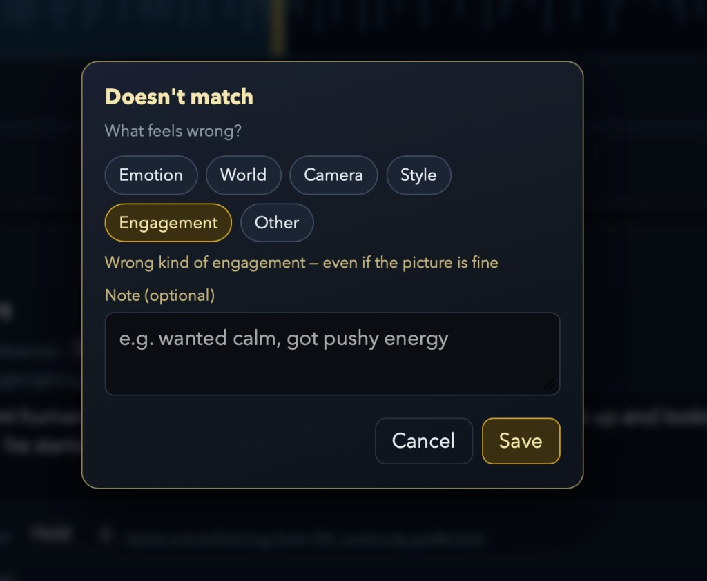

# Research context

Xochipilli is built by someone who studies everyday listening. This file records where that
background actually shows up in the software, and — just as importantly — where it does not.

It exists because the influence is real but easy to overstate. Read this before assuming
either that the tool is a research instrument or that the research is decoration.

Related: [DECISIONS.md](DECISIONS.md) (what shipped and why) · [CRAFT.md](CRAFT.md) (the edit
and personalization layer this file refers to).

## What this tool is not

- **Not a measurement instrument.** It does not administer scales, assign conditions, or
  produce data intended to support a claim about listeners.
- **Not a study.** There are no participants. The only person it records is its author.
- **Not evidence for the research.** Nothing the tool stores validates or tests any
  hypothesis about listening. It is a workbench that happens to be designed by someone with
  a particular way of framing what listening does.

Everything it writes stays on the author's machine. See [Local data](#local-data).

## The one idea that crossed over

Research on everyday listening increasingly treats the **episode** as the unit: one stretch
of listening, undertaken for a reason, in a real situation. The interesting question about an
episode is not whether the music was good but whether the listening got where it was meant
to go, and what it cost to get there.

That framing changed one concrete thing in this tool: **the vocabulary available for
rejecting a generated take.**

## Why `episode` is an Unmatch reason

When a take is wrong, the author records *why*. The reasons are a fixed taxonomy
(`app/taste.py`):

```
emotion · world · camera · style · episode · other
```



Five of those are craft complaints — the mood is off, the setting is wrong, the camera is
doing the wrong thing. `episode` is different in kind, and the interface says so in the one
line it gets: **wrong kind of engagement, even if the picture is fine.** The take can be
well made and still fail to do what this stretch of music is for. The note field suggests
the shape of the judgment rather than a quality rating:

> e.g. wanted calm, got pushy energy

That is a functional mismatch between an intended effect and a delivered one, which is the
shape of the episode-level judgment the research is about. Without that framing the reason
list would have stopped at five craft categories, and this failure would have been filed
under `emotion` or `other`, where it reads as taste rather than as a mismatch of purpose.

`episode` is counted separately (`episode_mismatch_count`), and `function` / `purpose` are
normalized onto it so the distinction does not erode through synonyms.

**A note on the label.** `episode` is the internal identifier; authors see **Engagement**
(EN), **体験の働き** (JA), **体验作用** (ZH). The research word would mean nothing to someone
directing a shot, so the button is worded for the person using it. That plain-language label
is *not* the involvement construct from the research, which describes a standing feature of a
person rather than one rejected take. The overlap in wording is a coincidence of English.

## Where the framework was deliberately refused

The more informative decision is a negative one.

Segments in Xochipilli are author-pinned intervals of a song — often on the order of
seconds. It would have been easy, and it would have looked theoretically impressive, to
stamp an episode label onto every segment: a per-interval dropdown of listening purposes,
aggregated into something chart-shaped.

**That was rejected.** From [CRAFT.md](CRAFT.md):

| Layer | Used? | Unit | Meaning |
|-------|-------|------|---------|
| `mode` (hold / shift / motion) | yes | segment | camera and chaining physics |
| `valence` / `arousal` | optional | segment | local reading, as dimensions |
| `emotion_keywords` | yes | segment | musical vocabulary and tags |
| **Episode stamped on a segment** | **no** | — | the theoretical unit is the listening occasion, not a time window |
| **Unmatch reason = `episode`** | **yes** | one judgment | "the effect I was after was not the one delivered" |

An episode is a whole occasion with a purpose and a situation. A pinned interval of a
waveform is not one, and slicing a song into segments does not produce a sequence of
episodes. So the concept enters only where a genuine judgment of purpose occurs — the moment
the author rejects a take — and nowhere else.

Valence and arousal are treated differently, because they are dimensional readings rather
than occasion-level constructs: they can sit on a segment without a category error, so they
are available per segment and sampled alongside `episode` rejections
(`affect_samples`).

## What the taste layer does with it

Recorded judgments feed back into generation rather than into a dataset. Repeated Unmatch
signals are soft-merged into the STYLE and NEGATIVE prompt fields on the next generate
(`taste.merge_prompt_fields`, on by default, per-project `apply_taste` to disable). The
purpose is to stop the author retyping the same correction, not to model the author.

The store is deliberately thin — counts, recent entries, rejected keywords, hints. It is
not designed to be analyzed, and its schema would be a poor one for research if it were.

## Local data

`<data>/user/taste.json`, where `<data>` is `~/Documents/Xochipilli` by default
(`XOCHIPILLI_DATA` to override). Outside the repository, never uploaded, and not
synchronized anywhere by the application.

## Honest limits of this framing

- **One user, no controls.** Anything visible in the taste store describes one person's
  afternoon, and cannot be generalized.
- **The reason taxonomy is untested.** Whether authors reliably distinguish `episode` from
  `emotion` when annotating their own rejections is an empirical question this tool does not
  answer.
- **The `episode` category is a design borrowing, not a contribution to the research.** It
  improved the software. It does not tell us anything new about listening.
